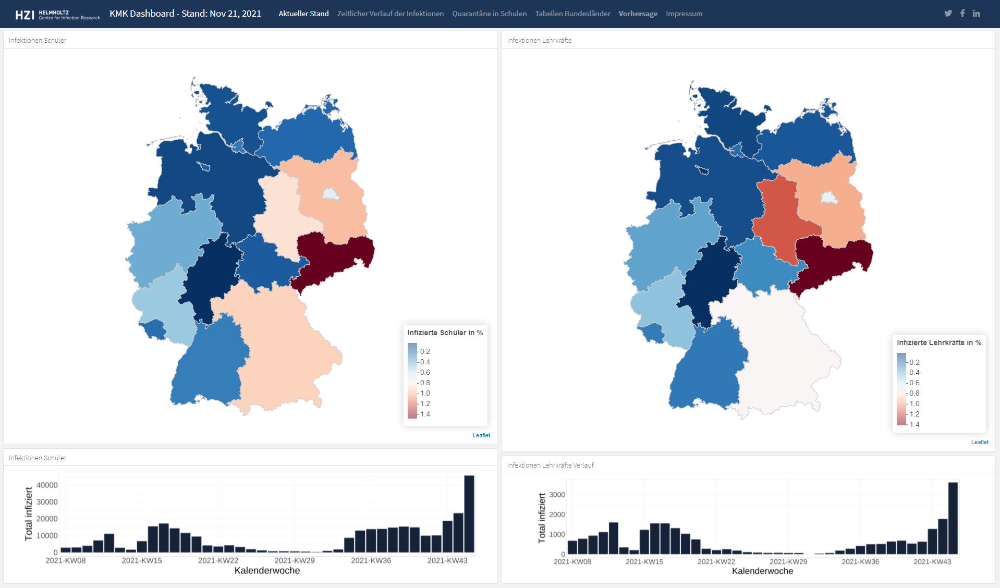

# The COVID-Schulen Dashboard

<!-- badges: start -->

<!-- badges: end -->

##### Table of Contents  
[Data source](#data-source)  
[Data](#data)  
[How to render](#how-to-render)  
[Used Packages](#used-Packages)  
[Deployment and reproducibly](#deployment-and-reproducibly)  

### Introduction

This [Covid19 Schulen dashboard](https://hzi-braunschweig.github.io/covid-schulen/) provides an overview of reported infection of SARS-CoV-2 infections in German school. The dashboard is built with R.  
 

### Data source

The data source is the documentation of the [German Kultusministerium](https://www.kmk.org/dokumentation-statistik/statistik/schulstatistik/schulstatistische-informationen-zur-covid-19-pandemie.html), which is weekly updated. The data is scrapped with this [function](R/kmk_scrap.R).

### Data

The raw data are excel files, containing information about infected pupils, infected teacher and quarantie on state (Bundesland) level.

### How to render

**step 1**  
- run [kmk_cleaning.R](R/kmk_cleaning.R)  
- creating rds (data) file in the data_clean folder "_clean_kpi_bl.rds"  

**step 2**  
- run [leaflet_bl.R](R/leaflet_bl.R)  
- generates the most recent data (calendar week) in data_clean folder "_kmkdata_bl.rds"  
- generates leaflet in "leaflet_maps/recent_maps_bl.RData"  

**step 3**  
- run [gen_verlauf.R](R/gen_verlauf.R)  
- generates the large facet map with trend ind "leaflet_maps/gall_bl.RData"  

**step 4**  
- run [leaflet_quara.RData](R/leaflet_quara.RData)  
- generates quartine leaflet graphs in "leaflet_maps/recent_maps_bl_quara.RData"  

**step 5**  
- run [run_county_render.R](R/run_county_render.R)  
-> generates the tables in tab "tabellen-bundesländer"  

**step 6**  
- run [forecast.R](R/forecast.R)  
- put all new files (stundent|teacher|kmk_data.csv) in the "data_clean" folder  
- generates ggplot forecasts "leaflet_maps/forecast.RData"  

**step 7**  
- knit [index.Rmd](index.Rmd)  
- hint: chunck test - crtl+f -> replace eval=TRUE with eval=FALSE  

### Used Packages

  - Visualisation:
      + [ggplot2](https://ggplot2.tidyverse.org/)
      + [leaflet](https://cran.r-project.org/web/packages/leaflet/)
      + [DT](https://cran.r-project.org/web/packages/DT/)
      + [flexdashboard](https://pkgs.rstudio.com/flexdashboard/)
      
  - Data wrangling:
      + [purrr](https://purrr.tidyverse.org/)
      + [dplyr](https://dplyr.tidyverse.org/)
      + [stringr](https://stringr.tidyverse.org/)
      + [tidyr](https://tidyr.tidyverse.org/)
      + [lubridate](https://lubridate.tidyverse.org/)
      + [broom](https://broom.tidymodels.org/)
      + [forcats](https://forcats.tidyverse.org/)
      
  - Data scrapping & data import:
      + [rvest](https://rvest.tidyverse.org/)
      + [readr](readr)
      + [readxl](https://readxl.tidyverse.org/)
      
  - Helper:
      + [leaflet.extras](https://cran.r-project.org/web/packages/leaflet.extras/)
      + [leafpop](https://cran.r-project.org/web/packages/leafpop/)
      + [htmltools](https://cran.r-project.org/web/packages/htmltools/)
      + [htmlwidgets](https://cran.r-project.org/web/packages/htmlwidgets/)

### Deployment and reproducibly

The dashboard is deployed via Github actions/Github pages.

For any question or feedback, you can either open an [issue](https://github.com/gstephan30/covid-schulen/issues) or look in the imprint/impressum of the dashboard for more contacts.

