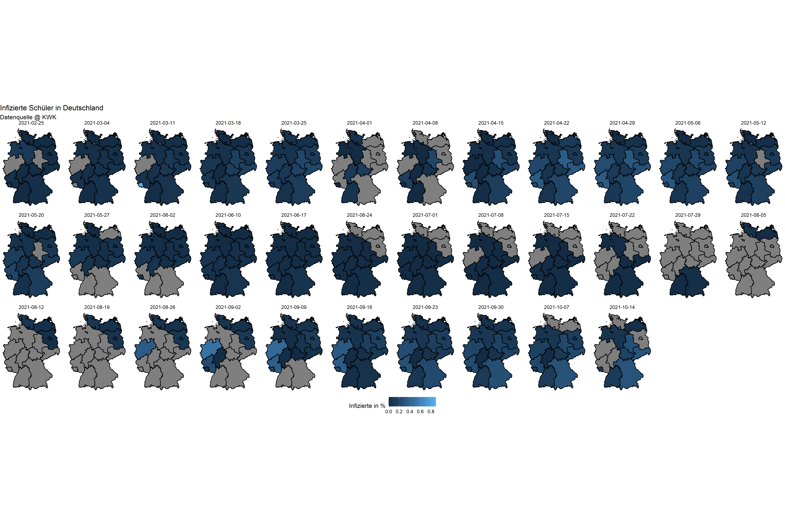

```{r setup, include=FALSE}
library(flexdashboard)
library(dplyr)
library(ggplot2)
library(lubridate)
library(emojifont)
library(leaflet)
library(readr)
library(tidyr)
library(stringr)

# import bl data from kmk.org
# df_bls <- list.files("~/kmk_dashboard/meta_data/", full.names = TRUE) %>% 
#   as_tibble() %>% 
#   mutate(datum = str_extract(value, "[0-9]{8}"),
#          datum = ymd(datum)) %>% 
#   arrange(desc(datum)) %>% 
#   pull(value) %>% 
#   .[1] %>% 
#   readRDS()

# load("~/kmk_dashboard/landing/20210709_kmk.RData")
# #load("~/kmk_dashboard/meta_data/20210709_meta.RData")
# df <- readRDS("meta_data/clean_kip.rds")
# forecast_students <- read_csv("~/kmk_dashboard/forecast/week26_student.csv")
# forecast_teacher <- read_csv("~/kmk_dashboard/forecast/week26_teacher.csv")


load("leaflet_maps/recent_maps_kreise.RData")
load("leaflet_maps/recent_maps_bl.RData")

# per country data
recent_kmkdata_file <- list.files("data_clean/", pattern = "kmkdata.rds", full.names = TRUE) %>% 
  as_tibble() %>% 
  mutate(datum = str_extract(value, "[0-9]{8}"),
         datum = ymd(datum)) %>% 
  arrange(desc(datum)) %>% 
  pull(value) %>% 
  .[1] %>% 
  readRDS()

forecast_students <- read_csv("data_clean/week40_student.csv")
forecast_teacher <- read_csv("data_clean/week40_teacher.csv")
time_kmk <- read_csv("data_clean/KMK_data.csv")
```


Aktueller Stand 
=================================================

Column {data-width=650}
-----------------------------------------------------------------------

### Infektionen Schüler

```{r eval=TRUE}
kmk_students_bl
```

Column {data-width=650}
-----------------------------------------------------------------------

### Infektionen Lehrkräfte

```{r eval=TRUE}
kmk_teacher_bl
```


Zeitlicher Verlauf der Infektionen {data-orientation=rows}
=================================================

Row 
-----------------------------------------------------------------------

### Inhaltlicher Verlauf

```{r evale= TRUE, out.width="150%"}

```

Row {data-height=100}
-----------------------------------------------------------------------

### Beschreibung 

Beschreibung Graphik.


Quarantäne in Schulen 
=================================================

Column
-----------------------------------------------------------------------

### Quarantäne von Schülern 

```{r}

```

Column
-----------------------------------------------------------------------

### Quarantäne von Lehrkräften 

```{r}

```


Tabellen Bundesländer
=============================


```{r eval=FALSE}
recent_kmkdata_file %>% 
  mutate(url = paste0("<a  href='", plot_link, "'>link</a>")) %>% 
  select(NAME_2, NAME_1, url, contains("students"), contains("teacher"), contains("schools")) %>% 
  DT::datatable(escape = FALSE)
  
```

<b>Germany (overall)</b> {data-navmenu="Forecast"}
=============================

Column 
-----------------------------------------------------------------------

### Count of COVID-19 Infected pupils

```{r eval=TRUE}
get_country <- function(data, country_code, sub_set) {
  #data <- forecast_students
  #country_code <- "TH"
  
  #subset <- "student"
  
  data %>%
    mutate(key = paste0(type, "_", quantile)) %>%
    select(target_week, location, key, value) %>%
    filter(location == country_code) %>%
    mutate(value = as.numeric(value)) %>%
    pivot_wider(names_from = key, values_from = value) %>%
    bind_rows(time_kmk %>% 
                filter(location == country_code) %>% 
                select(target_week = week,
                       location, point_NA = any_of(sub_set)) %>% 
                mutate(point_NA = ifelse(point_NA == "-", NA, point_NA),
                       point_NA = as.numeric(point_NA))) %>% 
    ggplot(aes(x = target_week, y = point_NA)) +
    geom_ribbon(
      aes(ymin = quantile_0.025,
          ymax = quantile_0.975),
      alpha = 0.25,
      fill = "#27408b"
    ) +
    geom_ribbon(aes(ymin = quantile_0.25,
                    ymax = quantile_0.75),
                alpha = 0.25,
                fill = "#27408b") +
    geom_point(color = "#27408b", size = 3) +
    geom_line(color = "#27408b", size = 1) +
    theme_light(base_size = 30) +
    labs(x = "Calendar Week",
         y = "estimate") +
    scale_x_continuous(breaks = scales::breaks_pretty(1))
}

```

Column {data-width=250}
-----------------------------------------------------------------------

### Vorhersage

The model is also developed as an age-structured model. It is adopted by deterministic SEIR (Susceptible-Exposed-Infectious-Recovered) model with additional compartments for the hospitalized, intensive unit, long-COVID and death. The rates of infection corresponding age groups depend on the social contacts by POLYMOD study. The model is fitted to reported cases from KMK and RKI (survstat). The fitted parameters are used to predict the number of cases in schools. We consider the last two weeks reported data to show two weeks forecasts. The forecasts is shown in student and teacher/teaching staff cases. 


Baden-Württemberg {data-navmenu="Forecast"}
=============================

Column
-----------------------------------------------------------------------

### Count of COVID-19 Infected pupils

```{r eval=TRUE}
get_country(forecast_students, "BW", "student")
```

### Count of COVID-19 Infected teacher

```{r eval=TRUE}
get_country(forecast_teacher, "BW", "teacher")
```

Column {data-width=350}
-----------------------------------------------------------------------

### Vorhersage

The model is also developed as an age-structured model. It is adopted by deterministic SEIR (Susceptible-Exposed-Infectious-Recovered) model with additional compartments for the hospitalized, intensive unit, long-COVID and death. The rates of infection corresponding age groups depend on the social contacts by POLYMOD study. The model is fitted to reported cases from KMK and RKI (survstat). The fitted parameters are used to predict the number of cases in schools. We consider the last two weeks reported data to show two weeks forecasts. The forecasts is shown in student and teacher/teaching staff cases. 


Bavaria {data-navmenu="Forecast"}
=============================

Column
-----------------------------------------------------------------------

### Count of COVID-19 Infected pupils

```{r eval=TRUE}
get_country(forecast_students, "BY", "student")
```

### Count of COVID-19 Infected teacher

```{r eval=TRUE}
get_country(forecast_teacher, "BY", "teacher")
```

Column {data-width=350}
-----------------------------------------------------------------------

### Vorhersage

The model is also developed as an age-structured model. It is adopted by deterministic SEIR (Susceptible-Exposed-Infectious-Recovered) model with additional compartments for the hospitalized, intensive unit, long-COVID and death. The rates of infection corresponding age groups depend on the social contacts by POLYMOD study. The model is fitted to reported cases from KMK and RKI (survstat). The fitted parameters are used to predict the number of cases in schools. We consider the last two weeks reported data to show two weeks forecasts. The forecasts is shown in student and teacher/teaching staff cases. 

Berlin {data-navmenu="Forecast"}
=============================

Column
-----------------------------------------------------------------------

### Count of COVID-19 Infected pupils

```{r eval=TRUE}
get_country(forecast_students, "BE", "student")
```

### Count of COVID-19 Infected teacher

```{r eval=TRUE}
get_country(forecast_teacher, "BE", "teacher")
```

Column {data-width=350}
-----------------------------------------------------------------------

### Vorhersage

The model is also developed as an age-structured model. It is adopted by deterministic SEIR (Susceptible-Exposed-Infectious-Recovered) model with additional compartments for the hospitalized, intensive unit, long-COVID and death. The rates of infection corresponding age groups depend on the social contacts by POLYMOD study. The model is fitted to reported cases from KMK and RKI (survstat). The fitted parameters are used to predict the number of cases in schools. We consider the last two weeks reported data to show two weeks forecasts. The forecasts is shown in student and teacher/teaching staff cases. 

Brandenburg {data-navmenu="Forecast"}
=============================

Column
-----------------------------------------------------------------------

### Count of COVID-19 Infected pupils

```{r eval=TRUE}
get_country(forecast_students, "BB", "student")
```

### Count of COVID-19 Infected teacher

```{r eval=TRUE}
get_country(forecast_teacher, "BB", "teacher")
```

Column {data-width=350}
-----------------------------------------------------------------------

### Vorhersage

The model is also developed as an age-structured model. It is adopted by deterministic SEIR (Susceptible-Exposed-Infectious-Recovered) model with additional compartments for the hospitalized, intensive unit, long-COVID and death. The rates of infection corresponding age groups depend on the social contacts by POLYMOD study. The model is fitted to reported cases from KMK and RKI (survstat). The fitted parameters are used to predict the number of cases in schools. We consider the last two weeks reported data to show two weeks forecasts. The forecasts is shown in student and teacher/teaching staff cases. 

Bremen {data-navmenu="Forecast"}
=============================

Column
-----------------------------------------------------------------------

### Count of COVID-19 Infected pupils

```{r eval=TRUE}
get_country(forecast_students, "HB", "student")
```

### Count of COVID-19 Infected teacher

```{r eval=TRUE}
get_country(forecast_teacher, "HB", "teacher")
```

Column {data-width=350}
-----------------------------------------------------------------------

### Vorhersage

The model is also developed as an age-structured model. It is adopted by deterministic SEIR (Susceptible-Exposed-Infectious-Recovered) model with additional compartments for the hospitalized, intensive unit, long-COVID and death. The rates of infection corresponding age groups depend on the social contacts by POLYMOD study. The model is fitted to reported cases from KMK and RKI (survstat). The fitted parameters are used to predict the number of cases in schools. We consider the last two weeks reported data to show two weeks forecasts. The forecasts is shown in student and teacher/teaching staff cases. 

Hamburg {data-navmenu="Forecast"}
=============================

Column
-----------------------------------------------------------------------

### Count of COVID-19 Infected pupils

```{r eval=TRUE}
get_country(forecast_students, "HH", "student")
```

### Count of COVID-19 Infected teacher

```{r eval=TRUE}
get_country(forecast_teacher, "HH", "teacher")
```

Column {data-width=350}
-----------------------------------------------------------------------

### Vorhersage

The model is also developed as an age-structured model. It is adopted by deterministic SEIR (Susceptible-Exposed-Infectious-Recovered) model with additional compartments for the hospitalized, intensive unit, long-COVID and death. The rates of infection corresponding age groups depend on the social contacts by POLYMOD study. The model is fitted to reported cases from KMK and RKI (survstat). The fitted parameters are used to predict the number of cases in schools. We consider the last two weeks reported data to show two weeks forecasts. The forecasts is shown in student and teacher/teaching staff cases. 

Hesse {data-navmenu="Forecast"}
=============================

Column
-----------------------------------------------------------------------

### Count of COVID-19 Infected pupils

```{r eval=TRUE}
get_country(forecast_students, "HE", "student")
```

### Count of COVID-19 Infected teacher

```{r eval=TRUE}
get_country(forecast_teacher, "HE", "teacher")
```

Column {data-width=350}
-----------------------------------------------------------------------

### Vorhersage

The model is also developed as an age-structured model. It is adopted by deterministic SEIR (Susceptible-Exposed-Infectious-Recovered) model with additional compartments for the hospitalized, intensive unit, long-COVID and death. The rates of infection corresponding age groups depend on the social contacts by POLYMOD study. The model is fitted to reported cases from KMK and RKI (survstat). The fitted parameters are used to predict the number of cases in schools. We consider the last two weeks reported data to show two weeks forecasts. The forecasts is shown in student and teacher/teaching staff cases. 

Lower Saxony {data-navmenu="Forecast"}
=============================

Column
-----------------------------------------------------------------------

### Count of COVID-19 Infected pupils

```{r eval=TRUE}
get_country(forecast_students, "NI", "student")
```

### Count of COVID-19 Infected teacher

```{r eval=TRUE}
get_country(forecast_teacher, "NI", "teacher")
```

Column {data-width=350}
-----------------------------------------------------------------------

### Vorhersage

The model is also developed as an age-structured model. It is adopted by deterministic SEIR (Susceptible-Exposed-Infectious-Recovered) model with additional compartments for the hospitalized, intensive unit, long-COVID and death. The rates of infection corresponding age groups depend on the social contacts by POLYMOD study. The model is fitted to reported cases from KMK and RKI (survstat). The fitted parameters are used to predict the number of cases in schools. We consider the last two weeks reported data to show two weeks forecasts. The forecasts is shown in student and teacher/teaching staff cases. 

Mecklenburg-Vorpommern {data-navmenu="Forecast"}
=============================

Column
-----------------------------------------------------------------------

### Count of COVID-19 Infected pupils

```{r eval=TRUE}
get_country(forecast_students, "MV", "student")
```

### Count of COVID-19 Infected teacher

```{r eval=TRUE}
get_country(forecast_teacher, "MV", "teacher")
```

Column {data-width=350}
-----------------------------------------------------------------------

### Vorhersage

The model is also developed as an age-structured model. It is adopted by deterministic SEIR (Susceptible-Exposed-Infectious-Recovered) model with additional compartments for the hospitalized, intensive unit, long-COVID and death. The rates of infection corresponding age groups depend on the social contacts by POLYMOD study. The model is fitted to reported cases from KMK and RKI (survstat). The fitted parameters are used to predict the number of cases in schools. We consider the last two weeks reported data to show two weeks forecasts. The forecasts is shown in student and teacher/teaching staff cases. 

North Rhine-Westphalia {data-navmenu="Forecast"}
=============================

Column
-----------------------------------------------------------------------

### Count of COVID-19 Infected pupils

```{r eval=TRUE}
get_country(forecast_students, "NW", "student")
```

### Count of COVID-19 Infected teacher

```{r eval=TRUE}
get_country(forecast_teacher, "NW", "teacher")
```

Column {data-width=350}
-----------------------------------------------------------------------

### Vorhersage

The model is also developed as an age-structured model. It is adopted by deterministic SEIR (Susceptible-Exposed-Infectious-Recovered) model with additional compartments for the hospitalized, intensive unit, long-COVID and death. The rates of infection corresponding age groups depend on the social contacts by POLYMOD study. The model is fitted to reported cases from KMK and RKI (survstat). The fitted parameters are used to predict the number of cases in schools. We consider the last two weeks reported data to show two weeks forecasts. The forecasts is shown in student and teacher/teaching staff cases. 

Rhineland-Palatinate {data-navmenu="Forecast"}
=============================

Column
-----------------------------------------------------------------------

### Count of COVID-19 Infected pupils

```{r eval=TRUE}
get_country(forecast_students, "RP", "student")
```

### Count of COVID-19 Infected teacher

```{r eval=TRUE}
get_country(forecast_teacher, "RP", "teacher")
```

Column {data-width=350}
-----------------------------------------------------------------------

### Vorhersage

The model is also developed as an age-structured model. It is adopted by deterministic SEIR (Susceptible-Exposed-Infectious-Recovered) model with additional compartments for the hospitalized, intensive unit, long-COVID and death. The rates of infection corresponding age groups depend on the social contacts by POLYMOD study. The model is fitted to reported cases from KMK and RKI (survstat). The fitted parameters are used to predict the number of cases in schools. We consider the last two weeks reported data to show two weeks forecasts. The forecasts is shown in student and teacher/teaching staff cases. 

Saarland {data-navmenu="Forecast"}
=============================

Column
-----------------------------------------------------------------------

### Count of COVID-19 Infected pupils

```{r eval=TRUE}
get_country(forecast_students, "SL", "student")
```

### Count of COVID-19 Infected teacher

```{r eval=TRUE}
get_country(forecast_teacher, "SL", "teacher")
```

Column {data-width=350}
-----------------------------------------------------------------------

### Vorhersage

The model is also developed as an age-structured model. It is adopted by deterministic SEIR (Susceptible-Exposed-Infectious-Recovered) model with additional compartments for the hospitalized, intensive unit, long-COVID and death. The rates of infection corresponding age groups depend on the social contacts by POLYMOD study. The model is fitted to reported cases from KMK and RKI (survstat). The fitted parameters are used to predict the number of cases in schools. We consider the last two weeks reported data to show two weeks forecasts. The forecasts is shown in student and teacher/teaching staff cases. 

Saxony {data-navmenu="Forecast"}
=============================

Column
-----------------------------------------------------------------------

### Count of COVID-19 Infected pupils

```{r eval=TRUE}
get_country(forecast_students, "SN", "student")
```

### Count of COVID-19 Infected teacher

```{r eval=TRUE}
get_country(forecast_teacher, "SN", "teacher")
```

Column {data-width=350}
-----------------------------------------------------------------------

### Vorhersage

The model is also developed as an age-structured model. It is adopted by deterministic SEIR (Susceptible-Exposed-Infectious-Recovered) model with additional compartments for the hospitalized, intensive unit, long-COVID and death. The rates of infection corresponding age groups depend on the social contacts by POLYMOD study. The model is fitted to reported cases from KMK and RKI (survstat). The fitted parameters are used to predict the number of cases in schools. We consider the last two weeks reported data to show two weeks forecasts. The forecasts is shown in student and teacher/teaching staff cases. 

Saxony-Anhalt {data-navmenu="Forecast"}
=============================

Column
-----------------------------------------------------------------------

### Count of COVID-19 Infected pupils

```{r eval=TRUE}
get_country(forecast_students, "ST", "student")
```

### Count of COVID-19 Infected teacher

```{r eval=TRUE}
get_country(forecast_teacher, "ST", "teacher")
```

Column {data-width=350}
-----------------------------------------------------------------------

### Vorhersage

The model is also developed as an age-structured model. It is adopted by deterministic SEIR (Susceptible-Exposed-Infectious-Recovered) model with additional compartments for the hospitalized, intensive unit, long-COVID and death. The rates of infection corresponding age groups depend on the social contacts by POLYMOD study. The model is fitted to reported cases from KMK and RKI (survstat). The fitted parameters are used to predict the number of cases in schools. We consider the last two weeks reported data to show two weeks forecasts. The forecasts is shown in student and teacher/teaching staff cases. 

Schleswig-Holstein {data-navmenu="Forecast"}
=============================

Column
-----------------------------------------------------------------------

### Count of COVID-19 Infected pupils

```{r eval=TRUE}
get_country(forecast_students, "SH", "student")
```

### Count of COVID-19 Infected teacher

```{r eval=TRUE}
get_country(forecast_teacher, "SH", "teacher")
```

Column {data-width=350}
-----------------------------------------------------------------------

### Vorhersage

The model is also developed as an age-structured model. It is adopted by deterministic SEIR (Susceptible-Exposed-Infectious-Recovered) model with additional compartments for the hospitalized, intensive unit, long-COVID and death. The rates of infection corresponding age groups depend on the social contacts by POLYMOD study. The model is fitted to reported cases from KMK and RKI (survstat). The fitted parameters are used to predict the number of cases in schools. We consider the last two weeks reported data to show two weeks forecasts. The forecasts is shown in student and teacher/teaching staff cases. 


Thuringia {data-navmenu="Forecast"}
=============================

Column 
-----------------------------------------------------------------------

### Forecast of COVID-19 Infected pupils

```{r eval=TRUE}
get_country(forecast_students, "TH", "student")
```

### Forecast of COVID-19 Infected teacher

```{r eval=TRUE}
get_country(forecast_teacher, "TH", "teacher")
```

Column {data-width=350}
-----------------------------------------------------------------------

### Vorhersage

The model is also developed as an age-structured model. It is adopted by deterministic SEIR (Susceptible-Exposed-Infectious-Recovered) model with additional compartments for the hospitalized, intensive unit, long-COVID and death. The rates of infection corresponding age groups depend on the social contacts by POLYMOD study. The model is fitted to reported cases from KMK and RKI (survstat). The fitted parameters are used to predict the number of cases in schools. We consider the last two weeks reported data to show two weeks forecasts. The forecasts is shown in student and teacher/teaching staff cases. 


